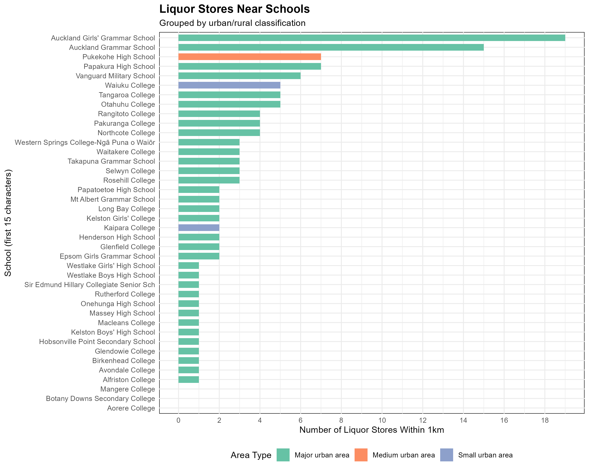

## Introduction

For this project, I concentrated on examining 40 secondary schools in the Auckland region, particularly state schools that had website information and data on school donations available. After adjusting for school type and location, I chose these schools because they reflect a wide range of urban categories (large, medium, and small urban areas). Meaningful comparisons of liquor store proximity across various community types are made possible by this reference collection.

I looked at the terms of service and robots.txt file on my high school's website before deciding whether to scrape data from it. Even if certain educational data is openly accessible, I think it's reasonable to restrict scraping to aggregate, non-personal data and to spread out requests to prevent school servers from becoming overloaded. The information I gathered is limited to publicly accessible data that does not jeopardize student or school's privacy.

## Visualisation

**Purpose:** My visualization compares the number of liquor stores within 1km radius across schools in different urban classifications, highlighting potential disparities in alcohol availability near educational institutions.



## Creativity

Three features of my visualization show creativity. In order to uncover fresh insights, I first integrated data from several sources, including a liquor store API and a school directory. Second, I used dynamic labeling to draw attention to Avondale College in particular as well as outlier schools. Third, in order to reduce clutter and make the image more helpful, I represented school size using a dual encoding scheme (color and size). The association between the urban environment and the availability of alcohol close to schools is made clearer by this innovative technique.

## Learning Reflection

The importance of ethical web scraping is one of the main concepts I took away from Module 5. I learned from the module to use respectful scraping techniques like rate-limiting queries and to always review robots.txt files and website terms before gathering data. Additionally, I discovered that APIs can offer more dependable data access than direct scraping.

This has sparked my interest in additional open APIs that can offer information about health or education. In order to find hidden patterns, I'm especially interested in investigating how to integrate data from many sources, such as community characteristics and school performance statistics. I want to learn more about the technical difficulty of cleaning and combining different data sets.

## Self Review

Two fundamental skills that are associated with the course objectives have been created by me via the five projects in STATS 220. First, I've become better at using ggplot2 for data visualization, understanding how to select the right kinds of charts and visually appealing mappings to convey ideas clearly. Second, I've improved my capacity to work with ethical considerations when working with real-world digital data sources, such as site scraping and API consumption (LO5: Obtain data from digital sources).

I can now identify, extract, and prepare my own data for analysis instead of just using pre-made data sets thanks to these projects. My ability to communicate data-driven stories has been especially enhanced by the repetitive method of developing and improving data visualizations.

## Appendix

```{r file='data_sources.R', eval=FALSE, echo=TRUE}

```

```{r file='visualisation.R', eval=FALSE, echo=TRUE}

```
